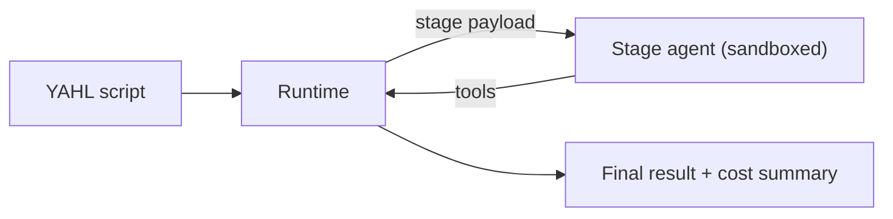

# Project YAHL (Yet Another High-level Language)

YAHL is a loose language that allow developer to write pseudo code to communicate with AI.

This is suppose to be a fun project, as of the end of Apr 2026, the AI models are seem like not preditable, even with skills.

And the worse part is the difficulty to trace and debug what and why the AI did something.

The whole idea was come from a moment that I was too lazy to actually code, and also too lazy to vibe code, given that eventually you will need to spend more (time+token) for AI if you do care about a project. That would be really great if I could casually write psuedo code that will still works. Voilà here we are!

The way it works in spirit: write pseudo code in a markdown file, a tiny runtime slices it into small steps, hands each step to an AI inside a sandbox, and stitches the answers back together. No magic, just a lot of small, observable handoffs. (still amazing!)

## Pain points it nudges at

I'm not pretending to solve any of these — but the shape of YAHL kind of pushes back on each one almost by accident.

- Every session starts cold. There's a workspace folder and a global context bucket — anything worth remembering can stick around.
- AI agents fall apart when their context window fills up. Here every step gets a fresh, small payload, so the rot doesn't compound. There's also a draft I'm chasing to keep the whole thing under 128k.
- Agents loop forever on the same broken tool call. Loops here keep a tiny knowledge log; if the same problem shows up three times unresolved, the loop gives up loudly instead of quietly burning tokens.
- Agents hallucinate APIs they've never seen. Skills live in a tidy folder the model can actually read, and project-specific facts sit on disk in plain JSON. Anything truly invented has to be marked with a `*` — the make-believe is opt-in.
- Nobody can debug what an AI did or why. Every step is logged with the exact request that went out, and the running state is just a plain object. When the AI gets weird I can edit one line of pseudo code (e.g. `website = null;`) and re-run. (in theory, it support debugger, for the AI!)

This isn't a victory lap. The shape just happens to line up with where the industry has landed in 2026.

## Status

With the 'tasks' in ~/orchestrator/TASKS, ~95% runs are pretty much the same flow (will even failed at the same place for the same reason), I do feel like the AI is now debuggable, observing the context movements gave me insight of how to 'fix' the AI steps, for example, in some loops, AI got confused about some unwanted temp variables (e.g. website), I could fix that by simply apply `website = null;` by the end of the previous loop.

I also do feel am treating AI as a very outdated computer -- the performance is slow, need to count the used memory (context window), etc. But after all it is still fun!

What I'm chasing next: use redis to dispatch messages instead of using stdin/out, may be a nicer UI instead of just terminal, don't hardcode the running tasks, nested stages, per line error logs (this one sounds really interesting!).

## Some catchy syntax

Here are some examples that will (very likely) works like magic.

1. const data = *get_data_from_yahoo_finance( within_1hour, stocks: [tesla, meta, google], open_close_high_low );
  - none of the variables exist, but the AI of cause can handle them, what's magic is the line will works most of the time!
2. const {html, javascript, css} = *get_or_create_python_tool(~/tools, split_html_js_css, *run_bash(curl, https://www.omniflex.io/, timeout: 5s));
  - this is my recent favourite to see the AI can understand the get_or_create almost too perfect!

If you don't care about token or just to see how stable the AI can be, you could even try

```
for each i of [0..100] {
  *write_to_stderr(i); // -- disclaimer: I've never tried ask printing to the stderr
}
```

A quick tour of the shapes:

- `return value` — the result of the whole script.
- `~/something` — the workspace; the AI can read and write here, but only here.
- `for each i of [0..100]` and `for each x of [array]` — loops, with an optional step like `,+2`.
- `REPLACE: ...` — a tiny system tag the runtime uses when a step needs a second pass after a tool call.
- `/skill_name(...)` — call into a skill from the skills folder; think of it as a named, well-documented capability.
- `*do_something(...)` — the `*` means "I don't have this function, AI please figure it out" (bash is the usual fallback).

A trimmed look at a real task pulling news from multiple sources:

```
const news_sources_knowledge = *read(~/knowledges/news-monitor/sources.json);

for each source of [news_sources] {
  const parsed_source = /web-search(source);
  const safe_url = *safe(parsed_source);

  parsed_news_source = [...parsed_news_source, safe_url];
}

for each source of [parsed_news_source] {
  const tmp_file_path = *save(*browse_or_curl(source), `~/tmp/${*uuidgen()}`);
  const byte_length = *get_byte_length(tmp_file_path);

  REPLACE: const website = /rag( chunkSize: 49600, tmp_file_path, byte_length, within_24hours, keep_full_url );

  const extracted_news = *extract_news(website);

  news = *combine([...news, ...extracted_news]);
  website = null;
}
```

## How it feels under the hood

- A YAHL script is just a markdown file with a code block of pseudo code.
- The runtime reads it, slices it into stages, and hands each stage to the AI in a clean sandbox.
- Anything worth keeping goes into a shared bucket; everything else is forgotten between stages.
- The AI talks back through a few structured tools — set a variable, run a shell command, ask for a chunked extraction.



## Run it

- Need Node + pnpm and Docker.
- This repo is now a pnpm workspace:
  - `runtime/` - YAHL runtime + orchestrator
  - `server/` - Express + Mongoose session records API
  - `web/` - Vite + shadcn session records UI
- Docker compose split:
  - root `docker-compose.yml` serves `mongo + server + web`
  - `runtime/docker-compose.yml` serves `redis + agent`
- Copy `.env.example` to `.env`, drop in an LLM API key, and optionally set `SESSION_API_BASE_URL`.
- Start runtime only: `pnpm run orchestrate`.
- Start API server: `pnpm run dev:server`.
- Start web app: `pnpm run dev:web`.
- Start all apps together: `pnpm run dev`.
- Start app stack with Docker: `pnpm run compose:up`
- Start runtime stack with Docker: `pnpm run compose:runtime:up`

## License

This project is licensed under the OmniFlex Source-Available License 1.0. See `LICENSE` for full terms.

Free use is granted for personal, educational, and non-profit research purposes.

Any profitable activity requires a separate commercial license, included but not limited to:
- integrating this software into a paid product or service;
- using this software in revenue-generating operations;
- offering hosting, consulting, support, or managed services based on this software;
- use by any company or corporate group with annual revenue above USD 500,000.

Commercial licensing contact:
- license@omniflex.io
- contact@zay-dev.com

No warranty is provided. No responsibility is assumed by the Licensor to the maximum extent permitted by law.
