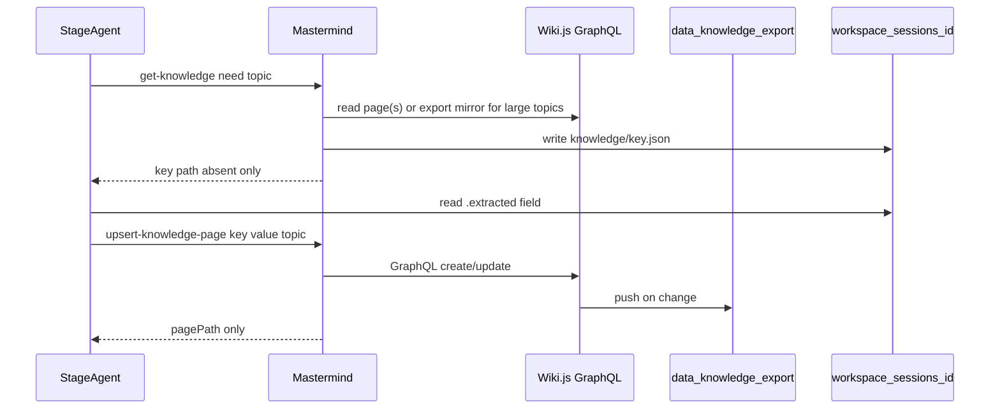
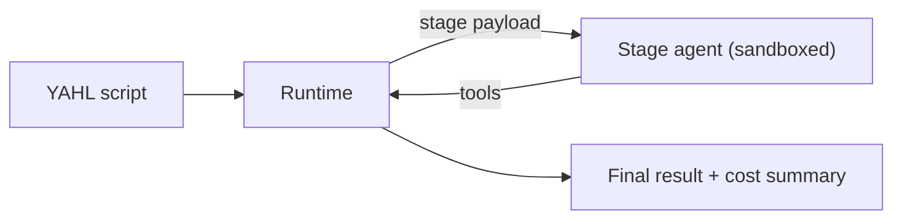
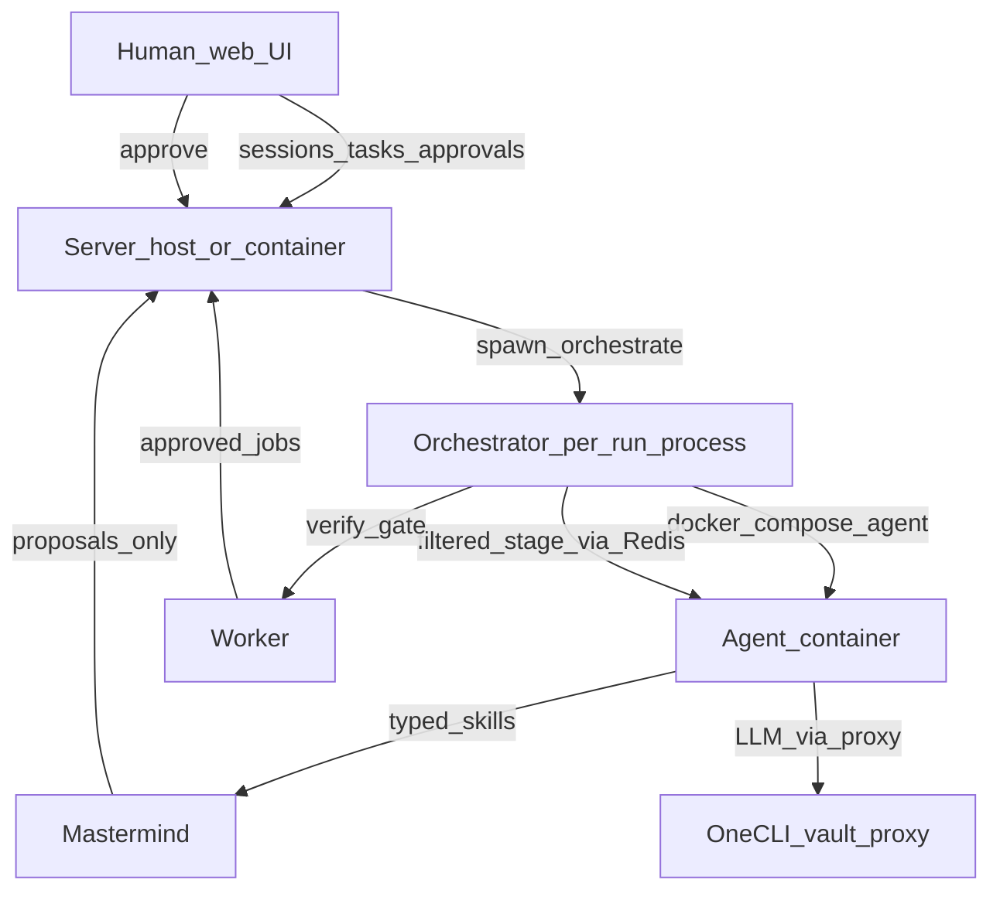

# Project YAHL (Yet Another High-level Language)

YAHL is a loose language for writing pseudo-code that talks to AI without pretending you've invented a compiler. [GitHub](https://github.com/Zay-Dev/project-yahl/tree/develop)

This is supposed to be a fun project. As of late April 2026, AI models still feel unpredictable, even with skills — and the worst part is tracing and debugging what they did and why.

The whole idea came from a moment when I was too lazy to actually code, and also too lazy to vibe-code my way into a maintenance nightmare. If you care about a project, you'll eventually spend more time and tokens cleaning up anyway. It would be nice to casually write pseudo-code that still works. Voilà — here we are.

The way it works in spirit: write pseudo-code in a markdown file, a tiny runtime slices it into small steps, hands each step to an AI inside a sandbox, and stitches the answers back together. No magic — just a lot of small, observable handoffs. (Still kind of amazing.)

## Pain points it nudges at

I'm not pretending to solve any of these — but the shape of YAHL kind of pushes back on each one almost by accident.

- Every session starts cold. There's a workspace folder and a global context bucket — anything worth remembering can stick around.
- AI agents fall apart when their context window fills up. Here every step gets a fresh, small payload, so the rot doesn't compound.
- Agents loop forever on the same broken tool call. Loops here keep a tiny knowledge log; if the same problem shows up three times unresolved, the loop gives up loudly instead of quietly burning tokens.
- Agents hallucinate APIs they've never seen. Skills live in a tidy folder the model can actually read, and project-specific facts sit on disk in plain JSON. Anything truly invented has to be marked with a `*` — the make-believe is opt-in.
- Nobody can debug what an AI did or why. Every step is logged with the exact request that went out, and the running state is just a plain object. When the AI gets weird I can edit one line of pseudo-code (e.g. `website = null;`) and re-run. (In theory it even supports a debugger — for the AI.)

This isn't a victory lap. The shape just happens to line up with where the industry has landed in 2026.

## Why knowledge matters (and why we invest here)

Models change; your curated knowledge doesn't. YAHL's value compounds when the assistant remembers *your* subjects, goals, and context — not when it one-shots a clever reply.

**User first.** Knowledge is what you browse, trust, edit, and link. Wiki pages under `topics/{slug}/` are the product surface, not a debug dump of JSON keys. Refresh keeps knowledge current without re-running full capture.

**Agents second (downstream).** Stage agents never read the full corpus; they get session extracts from `get-knowledge`. Better pages → better extracts → better behavior on every task that reads knowledge (`user_onboarding`, `knowledge_capture`, `hk_weather`, future tasks). Garbage summaries → repeated questions and wrong assumptions — that's a knowledge problem, not a model problem.

**Why so much effort.** Flat key-files and 64KB corpus walks produced disposable summaries. We invested in Wiki.js + elaboration rules + capture/refresh pipelines + topic governance because **knowledge quality is the primary lever on product quality** — more than picking a slightly newer model.

**What we built.** Wiki.js canonical store, `./data/knowledge_export` Local FS push export for scale, mastermind hybrid RAG (GraphQL + export mirror), capture/refresh tasks, human browse at **`WIKI_PUBLIC_URL`** (dedicated wiki URL), and a strict trust boundary. Details: [`docs/knowledge.md`](docs/knowledge.md).

## Status

With the tasks in `server/tasks/`, about 95% of runs follow the same path (as of mid-Jun 2026, I stopped counting this becausing it is too promising) — they'll even fail at the same line for the same reason, which is oddly comforting. I can actually debug this now: watch context move between stages, poke a line like `website = null;`, re-run. Still feels like operating a very smart but very old machine. You watch memory budget, babysit stage boundaries, and count tokens like it's 1998 and you pay per SMS. Still fun though.

But more importantly — it does feel like patching in the right direction. No more roll the dice and fingers crossed.

Stuff that already works (aka things that surprisingly do not explode):

- Redis transport between orchestrator and stage agent.
- Task catalog from `server/tasks/` via the tasks API; orchestrator loads YAML through the server with `--task-id`.
- **Tasks web UI:** browse, create, and edit `SKILL.yahl` at `/tasks`, `/tasks/new`, and `/tasks/:taskId`. In Docker, the server bind-mounts `./server/tasks` so edits persist on the host repo.
- **Tasks API:** `GET/POST /api/tasks`, `GET/PUT /api/tasks/:taskId`, `POST /api/runs`.
- **`askUserBatch.v1`:** multi-question ask-user pauses (text + radio/checkbox MC); scrollable drawer UI. Stages pause for a real user decision and continue with deterministic answer ids (finally, less mind-reading). If the orchestrator times out waiting, the session saves a checkpoint; after you answer, **Resume from checkpoint** in Session Detail kicks off continuation (Redis push wakes an in-flight wait faster when `REDIS_URL` is aligned).
- Session/event tracking with replayable step history and usage/cost visibility.
- Web UI: Sessions list, Session Detail with live logs/status, jump-to-session links, and Tasks authoring.
- Session detail view includes live stream panel, model aggregate table, step details dialog, and final result dialog.
- Fork-run flow supports editing structured request snapshots (`stage` YAHL object, `context.context`, `context.stage`, `context.types`) before rerun.
- Session `Stages` documents store `stage` as structured JSON (`logic`, `contextMode`, `loopSetup`, key allowlists, etc.), not compiled pseudo-code strings. Existing Mongo rows with `currentStage` strings are incompatible; reset stage collections in dev or run a one-off migration.
- Rerun can fast-forward prefix stages from saved `contextAfter` snapshots instead of re-running everything from zero.
- VM client runs on `isolated-vm` for stronger sandbox boundaries and fewer "hope-this-is-fine" moments.
- You can attach the orchestrator to a debugger, hit breakpoints, and poke variables manually while tracing execution.
- **Mastermind stack:** gateway (port 4100) and worker (port 4200, verify gates) in `docker compose`; orchestrator verify calls worker; `/mastermind(...)` in the agent for skills (requires `CURSOR_API_KEY`). Boot fail-fast when the SDK agent is not ready; stack probe via `pnpm run doctor`.
- **`design-questions`:** platform Mastermind skill for dynamic ask-user batches (pass `mission:` for subject framing).
- **`verifyAutoRetry`:** orchestrator in-process verify loop on stages with `verify: true` + `verifyAutoRetry: true`.
- **Task-local skills:** echoed from session snapshot to agent `~/task-skills/`; see **Authoring tasks** below.
- **Knowledge store:** Wiki.js canonical pages + `data/knowledge_export` Local FS export; agents read session extracts only — see **Why knowledge matters** and **Protecting the knowledge store** below.
- **Topic governance:** `resolve-topic` + `knowledge_tidy` background task (`background: true` in `SKILL.yahl`).
- **Background sessions:** cron/utility runs hidden by default on `/sessions` (toggle to show).
- **Platform UI:** `/platform/approvals` for notification/settings proposals; `/platform/cron-jobs` for cron job create/edit/delete (worker ticks via `POST /api/runs`).

Stuff to build:

- Direct user ↔ mastermind chat (deferred for v1; skills stay stateless for now).
- **A2UI done properly** — we tried bolting A2UI and it was a big fail; want real structured UI payloads, not another half-measure.
- **Go to stage (`go to stage <id>`)** — today when a stage fails, resume only picks up at that same stage. We want Mastermind (or the UI) to restart a session at an *earlier* stage so you can fix poisoned context upstream instead of fork-and-pray at the failure point.

Always want to improve:

- Per-stage input/output visibility — good enough to debug most days, never quite "done."
- OneCLI integration polish for safer secret handling.
- UI polish around authoring and inspecting YAHL scripts.

## Some catchy syntax

Examples that survive contact with reality a little better:

1. `CONTEXT` + `IF/ELSE` + inline user input (from `server/tasks/test`):
   - branch logic and ask a human for one number before the final state lands.
2. Nested loops + `EXTENDS:` + typed extraction pipeline (from `server/tasks/competitor_intel`):
   - long-form pseudo-code that still compiles into a useful run.

Quick stress test with less chaos and more signal:

```
for each i of [1..5,+2] {
  c += i;
}
```

Syntax reference:

- `~/something` — session scratch workspace (`AGENT_SESSION_HOME`); the agent can read and write here, not the whole repo.
- `~/task-skills/…` — task-local SKILL files echoed from the session snapshot (see **Authoring tasks**).
- `for each i of [0..100]` and `for each x of [array]` — loops, with an optional step like `,+2`.
- `CONTEXT: ...` — run deterministic context mutation in the VM before the next AI stage.
- `IF:` / `ELSE IF:` / `ELSE:` / `END:` — stage branching; condition decides which block runs.
- `REPLACE: ...` — system tag the runtime uses when a step needs a second pass after a tool call.
- `EXTENDS: ...` — append or merge into an existing context value without replacing it.
- `/ask-user-batch(...)` — pause for **`askUserBatch.v1`** (one or more questions per submit: text, radio, or checkbox MC).
- `/skill_name(...)` — call into a skill from the skills folder.
- `/mastermind(...)` — call the Mastermind gateway (research, verify, notifications, etc.).
- `*do_something(...)` — the `*` means "I don't have this function, AI please figure it out" (bash is the usual fallback).

`SKILL.yahl` is a single YAML document (`name`, `description`, optional `types`, and a `stages` list). Each stage has a `logic: |` block; the runtime compiles stages into the agent-facing script (loops, `CONTEXT:`, `IF:` branches, and brace-wrapped AI blocks). See `server/tasks/test/SKILL.yahl` for the canonical shape.

## Authoring tasks

Tasks can ship their own SKILL files — handy when you want assess/synthesize rules without bloating `mastermind/skills/`. At run start the server snapshots `taskYahl` + `taskSkills` onto the session; the orchestrator echoes that bundle into the session workspace and the agent reads it under `~/task-skills/`. (Forget `task-mission/SKILL.md` and the run dies before stage 1 — ask me how I know.)

- **Layout:** `server/tasks/{taskId}/SKILL.yahl` + optional `server/tasks/{taskId}/skills/**/*.md`
- **Snapshot:** `createRun` / `registerSession` persist `taskYahl` + `taskSkills` on the session document
- **Echo:** orchestrator writes the session snapshot → `data/workspace/sessions/{sessionId}/task-skills/` (agent `~/task-skills/`)
- **Hard requirement:** if `SKILL.yahl` contains `~/task-skills/` anywhere, you **must** ship `skills/task-mission/SKILL.md` — verified at run start; missing file → `task-skills echo incomplete`
- **System prompt:** orchestrator injects `task-mission` content via `mergeTaskSystemAppend`
- **Mastermind:** optional `guidelinePath: ~/task-skills/…/SKILL.md` on `research` (untrusted hints banner). Planning via orchestrator `nixeryRun: plan` / `plan-study`.
- **Examples:** `user_onboarding`, `knowledge_capture`, `knowledge_tidy` (see [`mastermind/skills/get-knowledge/SKILL.md`](mastermind/skills/get-knowledge/SKILL.md) for the read path)

```
server/tasks/my_task/
  SKILL.yahl
  skills/
    task-mission/SKILL.md   ← required when YAML references ~/task-skills/
    my-helper/SKILL.md
```

## Protecting the knowledge store

Curated knowledge lives in **Wiki.js** (Postgres) with a Local FS export at `data/knowledge_export/`. Stage agents do **not** get wiki, export files, or legacy flat keys mounted — they only see what Mastermind extracts into the current session scratch dir.


```mermaid
sequenceDiagram
  participant Agent as StageAgent
  participant MM as Mastermind
  participant Wiki as Wiki.js GraphQL
  participant Export as data_knowledge_export
  participant Scratch as workspace_sessions_id

  Agent->>MM: get-knowledge need topic
  MM->>Wiki: read page(s) or export mirror for large topics
  MM->>Scratch: write knowledge/key.json
  MM-->>Agent: key path absent only
  Agent->>Scratch: read .extracted field

  Agent->>MM: upsert-knowledge-page key value topic
  MM->>Wiki: GraphQL create/update
  Wiki->>Export: push on change
  MM-->>Agent: pagePath only
```

- **Container mounts** — agent: [`data/workspace/`](data/workspace/) + read-only [`runtime/orchestrator/SKILLS`](runtime/orchestrator/SKILLS) only; **no** wiki/export/knowledges ([`docker-compose.agent.yml`](docker-compose.agent.yml)). Mastermind: `./data/mastermind:/data`, read-only `./data/knowledge_export` ([`docker-compose.yml`](docker-compose.yml)).
- **No direct corpus access** — agents must not read wiki HTTP, export mirror, or legacy `~/knowledges/`; canonical store is mastermind-private only.
- **Session-scoped reads** — `get-knowledge` reads wiki corpus internally, writes `data/workspace/sessions/{sessionId}/knowledge/{key}.json`, returns `{ key, path: "~/knowledge/…", absent }` only ([`session-extract.ts`](mastermind/src/-knowledge/session-extract.ts), [`skills.ts`](mastermind/src/-handlers/skills.ts)).
- **Path injection blocked** — `get-knowledge` and `upsert-knowledge-page` reject caller `source` / `file` / `path` args ([`hasPathArgs`](mastermind/src/-knowledge/index.ts)).
- **Controlled writes** — `upsert-knowledge-page` accepts `key`+`value` or `page`+`content` with `topic` only; Mastermind maps legacy keys to wiki paths ([`upsert-knowledge-page` SKILL](mastermind/skills/upsert-knowledge-page/SKILL.md)).
- **Key sanitization** — session ids and extract keys sanitized before filesystem writes ([`session-extract.ts`](mastermind/src/-knowledge/session-extract.ts)).
- **Human browse** — Wiki.js at `WIKI_PUBLIC_URL` (dev: `http://127.0.0.1:3001`); web sidebar links there directly; agents never use this route.
- **Untrusted task hints** — task SKILL files loaded via `guidelinePath` on `research` / `plan` get an explicit untrusted-content banner in the Mastermind prompt ([`UNTRUSTED_GUIDELINE_PREAMBLE`](mastermind/src/-handlers/skills.ts)).
- **Workspace vs knowledge** — `extract-info` = RAG over session workspace files; `get-knowledge` = curated wiki corpus. Different skills, different trust boundary.

Two-step read in stage logic:

```text
const extractRef = /mastermind(get-knowledge, topic: user-onboarding, need: identity, goals);
const knowledge = extractRef.absent ? '<none>' : (*read(extractRef.path)).extracted;
```

## How it works under the hood

- A YAHL task file is YAML; stage `logic` holds the pseudo-code the agent or VM runs.
- The runtime reads it, slices it into stages, runs VM-evaluable control blocks (`CONTEXT` / `IF` family) inside `isolated-vm`, then hands AI stages to the model in a sandboxed agent container.
- Anything worth keeping goes into a shared context bucket; everything else is forgotten between stages.
- Each stage declares **key allowlists** in YAML so context stays bounded and debuggable:
  - `contextKeys` — which shared context (and loop-local) keys the stage/agent may read
  - `produceContextKeys` — which keys the stage must write via `set_context` before it can finish (runtime retries if any are missing)
  - `updateContextKeys` — which produced keys get merged back into global context after the stage (on loops, after each iteration)
- The AI talks back through structured tools — set a variable, run a shell command, ask user choices, ask for chunked extraction, call Mastermind.


```mermaid
flowchart LR
  Script["YAHL script"] --> Runtime["Runtime"]
  Runtime -->|stage payload| Agent["Stage agent (sandboxed)"]
  Agent -->|tools| Runtime
  Runtime --> Result["Final result + cost summary"]
```

## Run it

**Prerequisites:** Node, pnpm, Docker.

**Monorepo layout** (Omniflex workspace member; install packages from `../`):

| Path | Package / role |
|------|----------------|
| `runtime/` | `@project-yahl/runtime` — YAHL runtime + orchestrator |
| `server/` | `@project-yahl/server` — Express + Mongoose session/tasks API |
| `web/` | Vite + shadcn — Sessions, Tasks, platform approvals, cron jobs |
| `mastermind/` | Personal assistant gateway (Cursor SDK skills) |
| `worker/` | Cron ticks (via server API), platform approvals, **verify gate** (`agent --yolo` CLI) |

Install and build framework packages from the **Omniflex repo root**:

```bash
cd ..
pnpm install
pnpm -r --filter "./infras/**" run build
```

Copy [`.env.example`](.env.example) to `.env`. Set at minimum:

- `HOST_REPO_ROOT` — absolute path to this repo (required for agent workspace bind mounts)
- `ONECLI_DASHBOARD_URL` and `ONECLI_API_KEY` — OneCLI proxy for LLM keys
- `CURSOR_API_KEY` — required for Mastermind SDK skills and worker verify CLI

Copy `server/.env.example` to `server/.env` if you run the server standalone.

### Docker Compose

| File | Purpose |
|------|---------|
| [`docker-compose.yml`](docker-compose.yml) | Infra and optional built server/web |
| [`docker-compose.agent.yml`](docker-compose.agent.yml) | Per-session agent container (orchestrator only) |

**`pnpm run compose:up`** starts local infra: mongo, redis, onecli, onecli_postgres, **mastermind** (4100), **worker**.

**`pnpm run compose:up:all`** builds and starts mongo, redis, onecli, onecli_postgres, **server** (4000), **web** (5173). Does not start mastermind/worker — use `compose:up` for those, or start them manually from the same compose file.

Image build context is the **Omniflex monorepo root** (`..` from project-yahl). App paths use `OMNIFLEX_APP_DIR` (default `project-yahl`). `COMPOSE_PROJECT_NAME` is independent (Docker naming only).

The agent compose file sets `MASTERMIND_API_URL=http://mastermind:4100` for stage agents.

**Local volume data** (gitignored): [`data/`](data/) (mongo, onecli, mastermind, workspace session files), [`runtime/.onecli/`](runtime/.onecli/) (OneCLI CA overrides).

**Dockerfiles:** [`server/Dockerfile`](server/Dockerfile), [`web/Dockerfile`](web/Dockerfile), [`runtime/Dockerfile.agent`](runtime/Dockerfile.agent) (built on the host when orchestrator runs).

#### Why it feels safe (roles and boundaries)

This is about **blast-radius design**, not a formal security audit. It assumes you trust the **server control plane** (host in local dev, `server` container in Docker prod) and your OneCLI vault config.

Runs are started by the server via [`spawn-orchestrate.ts`](server/src/modules/sessions/use-cases/spawn-orchestrate.ts) (`POST /api/runs`, fork, ask-user/verify resume). In **local dev** that orchestrator child process runs on your **host** (alongside `pnpm run dev`); you can still run `pnpm run orchestrate` manually for debugging. In **Docker prod** (`compose:up:all`) the same spawn happens **inside the server container** (built orchestrator + `docker.sock` to bring up agents). The orchestrator is not its own long-lived compose service — it is a per-run process the server (or you, in dev) starts.

| Role | Runs as | Can touch | Cannot / should not |
|------|---------|-----------|---------------------|
| **Human (web UI)** | Browser | Sessions, tasks, ask-user answers, platform approvals | Spawn agents, read vault keys, bypass approval queue |
| **Server** | Host (`pnpm run dev:server`) or `server` container (prod) | Mongo, task files (`server/tasks/`), spawn orchestrator per run; `docker.sock` in container for agent containers | Run stage logic; control plane only |
| **Orchestrator** | Child process spawned by server (host in dev, inside `server` container in Docker prod); optional manual `pnpm run orchestrate` on host | Stage pipeline, context filtering, verify gates, agent lifecycle | Expose full repo or whole task YAML to the agent; VM control flow stays on orchestrator via `isolated-vm` |
| **Stage agent** | Ephemeral `agent-{sessionId}` container | Session scratch `~/` → `/workspace/sessions/{sessionId}/`, read-only skills, Redis stage queue, typed HTTP to mastermind / OneCLI proxy | Repo source, Mongo, direct vault — tools API only |
| **Mastermind** | `mastermind` container (4100) | Wiki.js GraphQL + read-only `data/knowledge_export`, workspace `/workspace`, Cursor SDK skills | Side effects without approval — proposals go to server first |
| **Wiki** | `wiki` container (`127.0.0.1:${WIKI_PORT}` on host) | Wiki.js Postgres + Local FS export at `data/knowledge_export` | Agent access — human browse at `WIKI_PUBLIC_URL` only |
| **Worker** | `worker` container | Cron (via server API), platform approvals, **verify gate** (Cursor CLI) | Does not spawn orchestrator or agent containers |
| **OneCLI** | `onecli` container | Provider secrets in vault; MITM proxy (10255) | Keys are scoped by dashboard host/path rules you configure |

Concurrent sessions each get their own agent container and scratch dir (agent `~/` = session subdir; see [mastermind/decision-log.md](mastermind/decision-log.md)).

**Local dev:** server on host spawns orchestrator on host; agents still run in Docker via `docker-compose.agent.yml`. Manual `pnpm run orchestrate` bypasses the server spawn path but uses the same agent isolation.

**Docker prod:** server container spawns orchestrator inside the container (`dist/orchestrator` when `NODE_ENV=production`); the server’s `docker.sock` mount starts per-session agent containers on the shared network.

**How the agent container is restricted:**

- **Ephemeral and scoped** — orchestrator brings up one agent per run ([`compose-onecli.ts`](runtime/orchestrator/-docker/compose-onecli.ts), project `agent-{sessionId}`), then tears it down.
- **Minimal mounts** — only [`data/workspace/`](data/workspace/) (writable) and [`runtime/orchestrator/SKILLS`](runtime/orchestrator/SKILLS) (`:ro` at `/opt/skills`). No `data/mastermind/`, server code, tasks tree, or `.env` in the agent image.
- **Session scratch** — `AGENT_SESSION_HOME=/workspace/sessions/{sessionId}`; knowledge via `get-knowledge` → `~/knowledge/{key}.json` only — never the canonical corpus ([`docker-entrypoint.sh`](runtime/agent/docker-entrypoint.sh); see **Protecting the knowledge store**).
- **Structured tools only** — `run_bash`, `browser`, `set_context`, `ask_user`, `mastermind`; orchestrator applies writes and enforces `produceContextKeys` / `contextKeys` allowlists.
- **One stage at a time** — Redis envelope carries filtered context + a single stage payload; the model does not see full task YAML or future stages.
- **LLM keys sanitized** — with OneCLI, orchestrator injects **proxy env + CA** into the agent override; keep `LLM_API_KEY` as placeholder on the host. Internal services stay on `NO_PROXY` (direct, not through the proxy). See **OneCLI setup** below for vault rules.
- **Mastermind is HTTP** — agent calls `MASTERMIND_API_URL` with named skills; `CURSOR_API_KEY` stays in the mastermind container. Outbound notifications/settings are **proposals** until someone approves at `/platform/approvals`.
- **VM control flow off-agent** — `CONTEXT` / `IF` blocks run in `isolated-vm` on the orchestrator process, not inside the agent.

`docker.sock` on **server** only: the server spawns orchestrator/agent containers per run. It is not mounted into agent or worker containers.


```mermaid
flowchart TB
  human[Human_web_UI]
  server[Server_host_or_container]
  orch[Orchestrator_per_run_process]
  agent[Agent_container]
  mm[Mastermind]
  onecli[OneCLI_vault_proxy]
  worker[Worker]

  human -->|sessions_tasks_approvals| server
  server -->|spawn_orchestrate| orch
  orch -->|docker_compose_agent| agent
  orch -->|filtered_stage_via_Redis| agent
  orch -->|verify_gate| worker
  agent -->|typed_skills| mm
  agent -->|LLM_via_proxy| onecli
  mm -->|proposals_only| server
  human -->|approve| server
  worker -->|approved_jobs| server
```

### Local development

1. Start infra: `pnpm run compose:up`
2. Run API + runtime: `pnpm run dev` (server + runtime hot reload)
3. Run web (separate terminal): `pnpm run dev:web`
4. Run a session: `pnpm run orchestrate`

Individual commands:

| Command | What it does |
|---------|--------------|
| `pnpm run compose:up` | Infra only (mongo, redis, onecli, mastermind, worker) |
| `pnpm run compose:up:all` | Full Docker stack (infra + built server + web) |
| `pnpm run dev` | Server + runtime on the host |
| `pnpm run dev:server` | API server only |
| `pnpm run dev:web` | Web UI only |
| `pnpm run orchestrate` | Run orchestrator (spawns agent containers) |

The server container bind-mounts `./server/tasks` so Tasks UI edits persist on the host repo.

### Advanced orchestrate flags

| Flag | Purpose |
|------|---------|
| `--session-id <id>` | Session to run (required; server prepares task/fork state before spawn) |
| `--resume-id <questionId>` | Ask-user checkpoint resume |
| `--verify-resume-id <verifyId>` | Verify checkpoint resume |
| `--produce-keys-resume-id <verifyId>` | Produce-keys retry resume |

Create a session via `POST /api/tasks/:taskId/runs` (or fork API), then orchestrate with `--session-id` only. Deprecated: `--task-id`, `--forkrun-id`.

Example: `pnpm run orchestrate -- --session-id my-debug-session`

### OneCLI setup

1. Start infra: `pnpm run compose:up`
2. Open OneCLI dashboard at `http://127.0.0.1:10254`
3. Create an agent identity and copy its token
4. Add provider credentials to OneCLI vault with correct host/path patterns
5. Set `ONECLI_DASHBOARD_URL` and `ONECLI_API_KEY` in `.env`
6. Run one orchestrator session to bootstrap shared override files under `runtime/.onecli/`
7. Keep `LLM_API_KEY` / `DEEPSEEK_API_KEY` as placeholders only. Browser automation uses Stagehand (local Chromium in the agent container; see [`runtime/orchestrator/SKILLS/stagehand/SKILL.md`](runtime/orchestrator/SKILLS/stagehand/SKILL.md)).

### Smoke tests

```bash
# OneCLI dashboard
curl -sf http://127.0.0.1:10254/

# OneCLI proxy route
curl -x http://127.0.0.1:10255 -H "Authorization: Bearer placeholder" https://api.deepseek.com/models

# Mastermind health
curl -sf http://127.0.0.1:4100/health

# Server aggregated health (mongo + mastermind)
curl -sf http://127.0.0.1:4000/__/health

# Worker health
curl -sf http://127.0.0.1:4200/health

# Full stack doctor (host)
pnpm run doctor

# Runtime
pnpm run orchestrate
```

### Troubleshooting OneCLI

| Symptom | Check |
|---------|-------|
| `gateway unreachable` | Root stack is up; `onecli` container is healthy |
| `sdk config fetch failed` | `ONECLI_DASHBOARD_URL` and `ONECLI_API_KEY` are set and valid |
| `certificate rejected` | `runtime/.onecli/` contains refreshed CA files and compose override |
| `provider key not injected` | Host/path matching and agent permissions in OneCLI dashboard |

### API reference

**Tasks**

| Method | Path | Description |
|--------|------|-------------|
| GET | `/api/tasks` | List discovered YAHL tasks |
| POST | `/api/tasks` | Create a task |
| GET | `/api/tasks/:taskId` | Get task YAML/metadata |
| PUT | `/api/tasks/:taskId` | Update a task |
| POST | `/api/runs` | Start an orchestrator run |

**Sessions**

| Method | Path | Description |
|--------|------|-------------|
| GET | `/api/sessions` | List sessions (add `?includeArchived=true` for archived) |
| GET | `/api/sessions/:sessionId` | Get session |
| PATCH | `/api/sessions/:sessionId` | Patch session |
| DELETE | `/api/sessions/:sessionId` | Soft- or hard-delete |
| GET | `/api/sessions/:sessionId/events/stream` | SSE live events |
| GET | `/api/sessions/:sessionId/stages/replay` | Stage rows for prefix fast-forward |
| POST | `/api/sessions/:sessionId/fork-sessions` | Create fork session and spawn orchestrator |
| POST | `/api/sessions/:sessionId/verify-checkpoints/:verifyId/resume` | Resume from ask-user timeout checkpoint |

**Fork sessions**

| Method | Path | Description |
|--------|------|-------------|
| GET | `/api/fork-sessions/:forkSessionId` | Load fork setup for orchestrator |

**Platform** (Mastermind proposals, cron jobs, worker queue)

| Method | Path | Description |
|--------|------|-------------|
| GET | `/api/platform/proposals/pending` | List pending proposals |
| POST | `/api/platform/proposals/:proposalId/approve` | Approve a proposal |
| POST | `/api/platform/proposals/:proposalId/reject` | Reject a proposal |
| POST | `/api/platform/proposals/notifications` | Draft notification proposal |
| POST | `/api/platform/proposals/settings` | Draft settings proposal |
| GET | `/api/platform/work/pending` | List pending worker jobs |
| GET | `/api/platform/cron/jobs` | List cron jobs |
| POST | `/api/platform/cron/jobs` | Create a cron job |
| GET | `/api/platform/cron/jobs/:id` | Get a cron job |
| PATCH | `/api/platform/cron/jobs/:id` | Update a cron job |
| DELETE | `/api/platform/cron/jobs/:id` | Soft-delete a cron job |

SSE streams expose live run logs (`meta` / `log` / `status`) and session events for the web UI.

Session persistence uses normalized Mongo collections (`Sessions`, `Stages`, `SessionToolCalls`, `SessionModelResponses`, `SessionAskUserQuestions`, `SessionVerifyCheckpoints`, `ForkSessions`, and related rows). After upgrading schema, wipe the database or drop those collections so old single-document `sessions` rows do not conflict with the new layout.

### Ask-user timeout and recovery

Orchestrator waits at most `YAHL_ASK_USER_MAX_WAIT_MS` (default `600000`) and polls every `YAHL_ASK_USER_POLL_MS` (default `250`). After a timeout it stores a verify checkpoint on the session; the web UI **Resume from checkpoint** POSTs `/api/sessions/:sessionId/verify-checkpoints/:verifyId/resume`.

With `REDIS_URL` set consistently on **server** and **orchestrator/agent**, answering an ask-user question publishes to `yahl:ask-user-answered:<sessionId>` so an in-flight wait can wake before the next poll interval.

## License

This project is licensed under the OmniFlex Source-Available License 1.0. See `LICENSE` for full terms.

Free use is granted for personal, educational, and non-profit research purposes.

Any profitable activity requires a separate commercial license, included but not limited to:
- integrating this software into a paid product or service;
- using this software in revenue-generating operations;
- offering hosting, consulting, support, or managed services based on this software;
- use by any company or corporate group with annual revenue above USD 500,000.

Commercial licensing contact:
- license@omniflex.io
- contact@zay-dev.com

No warranty is provided. No responsibility is assumed by the Licensor to the maximum extent permitted by law.
