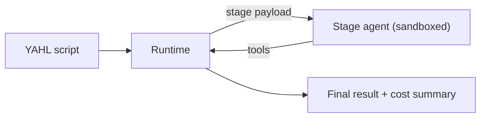

# Project YAHL (Yet Another High-level Language)

YAHL is a loose language that allow developer to write pseudo code to communicate with AI.

This is suppose to be a fun project, as of the end of Apr 2026, the AI models are seem like not preditable, even with skills.

And the worse part is the difficulty to trace and debug what and why the AI did something.

The whole idea was come from a moment that I was too lazy to actually code, and also too lazy to vibe code, given that eventually you will need to spend more (time+token) for AI if you do care about a project. That would be really great if I could casually write psuedo code that will still works. Voilà here we are!

The way it works in spirit: write pseudo code in a markdown file, a tiny runtime slices it into small steps, hands each step to an AI inside a sandbox, and stitches the answers back together. No magic, just a lot of small, observable handoffs. (still amazing!)

## Pain points it nudges at

I'm not pretending to solve any of these — but the shape of YAHL kind of pushes back on each one almost by accident.

- Every session starts cold. There's a workspace folder and a global context bucket — anything worth remembering can stick around.
- AI agents fall apart when their context window fills up. Here every step gets a fresh, small payload, so the rot doesn't compound. There's also a draft I'm chasing to keep the whole thing under 128k.
- Agents loop forever on the same broken tool call. Loops here keep a tiny knowledge log; if the same problem shows up three times unresolved, the loop gives up loudly instead of quietly burning tokens.
- Agents hallucinate APIs they've never seen. Skills live in a tidy folder the model can actually read, and project-specific facts sit on disk in plain JSON. Anything truly invented has to be marked with a `*` — the make-believe is opt-in.
- Nobody can debug what an AI did or why. Every step is logged with the exact request that went out, and the running state is just a plain object. When the AI gets weird I can edit one line of pseudo code (e.g. `website = null;`) and re-run. (in theory, it support debugger, for the AI!)

This isn't a victory lap. The shape just happens to line up with where the industry has landed in 2026.

## Status

With the 'tasks' in ~/orchestrator/TASKS, ~95% runs are pretty much the same flow (will even failed at the same place for the same reason), I do feel like the AI is now debuggable, observing the context movements gave me insight of how to 'fix' the AI steps, for example, in some loops, AI got confused about some unwanted temp variables (e.g. website), I could fix that by simply apply `website = null;` by the end of the previous loop.

And yes, this still feels like operating a very smart but very old machine. You watch memory budget, babysit stage boundaries, and count tokens like it's 1998 and you pay per SMS. Still fun though.

But more important is - it does feel like patching to the right direction! no more roll dice and fingers crossed!

Stuff that already works (aka things that surprisingly do not explode):
- Redis transport between orchestrator and stage agent.
- Task discovery from `runtime/orchestrator/TASKS`, with resolver support for `SKILL.md`, `index.md`, and `SKILL.yahl` (plus optional direct `--task-path` override when you're feeling fancy).
- Runtime `ask-user` flow is live: stages can pause for a real user decision and continue with deterministic answer ids (finally, less mind-reading). If the orchestrator times out waiting, the session saves a checkpoint; after you answer, **Resume from checkpoint** in Session Detail kicks off continuation (Redis push wakes an in-flight wait faster when `REDIS_URL` is aligned).
- Session/event tracking with replayable step history and usage/cost visibility.
- Web UI now has proper Runner + Sessions + Session Detail flow with live logs/status and jump-to-session links.
- Session detail view includes live stream panel, model aggregate table, step details dialog, and final result dialog (aka less guessing, more actual receipts).
- Fork-run flow supports editing structured request snapshots (`stage` YAHL object, `context.context`, `context.stage`, `context.types`) before rerun, which makes debugging way less painful.
- Session `Stages` documents store `stage` as structured JSON (`logic`, `contextMode`, `loopSetup`, key allowlists, etc.), not compiled pseudo-code strings. Existing Mongo rows with `currentStage` strings are incompatible; reset stage collections in dev or run a one-off migration.
- Rerun can fast-forward prefix stages from saved `contextAfter` snapshots instead of re-running everything from zero.
- VM client now runs on `isolated-vm` for stronger sandbox boundaries and fewer "hope-this-is-fine" moments.
- You can attach the orchestrator to a debugger, hit breakpoints, and even poke variables manually while tracing execution. (sounds pretty like coding right?)

Stuff to build:
- Better nested stage ergonomics and debugging flow.
- More granular per-line or per-step error visibility.
- Full input/output logs per stage (so debugging is less detective work, more replay button).
- OneCLI integration for safer secret handling (ongoing polish, fewer paper cuts).
- Friendlier UI polish around authoring and inspecting YAHL scripts.

## Some catchy syntax

Here are some examples that now survive contact with reality a little better.

1. `CONTEXT` + `IF/ELSE` + inline user input (from `TASKS/test`):
  - yes, you can branch logic and still ask a human for one number before the final state lands.
2. nested loops + `EXTENDS:` + typed extraction pipeline (from `TASKS/competitor_intel`):
  - yes, this one reads like pseudo-code fan fiction, and yes, it still compiles into a useful run.

If you want a quick stress test with less chaos and more signal, try this:

```
for each i of [1..5,+2] {
  c += i;
}
```

A quick tour of the shapes:

- `~/something` — the workspace; the AI can read and write here, but only here.
- `for each i of [0..100]` and `for each x of [array]` — loops, with an optional step like `,+2`.
- `CONTEXT: ...` — run deterministic context mutation in the VM before the next AI stage (handy for surgical fixes).
- `IF:` / `ELSE IF:` / `ELSE:` / `END:` — stage branching; condition decides which block actually runs.
- `REPLACE: ...` — a tiny system tag the runtime uses when a step needs a second pass after a tool call.
- `EXTENDS: ...` — append or merge into an existing context value without nuking what you already built.
- `/ask-user(...)` — pause the run, ask one multiple-choice question, then resume with the selected answer.
- `/skill_name(...)` — call into a skill from the skills folder; think of it as a named, well-documented capability.
- `*do_something(...)` — the `*` means "I don't have this function, AI please figure it out" (bash is the usual fallback).

`SKILL.yahl` is a single YAML document (`name`, `description`, optional `types`, and a `stages` list). Each stage has a `logic: |` block; the runtime compiles stages into the agent-facing script (loops, `CONTEXT:`, `IF:` branches, and brace-wrapped AI blocks). See `runtime/orchestrator/TASKS/test/SKILL.yahl` for the canonical shape.

## How it feels under the hood

- A YAHL task file is YAML; stage `logic` holds the pseudo-code the agent or VM runs.
- The runtime reads it, slices it into stages, runs VM-evaluable control blocks (`CONTEXT` / `IF` family) inside `isolated-vm`, then hands AI stages to the model in a clean sandbox.
- Anything worth keeping goes into a shared bucket; everything else is forgotten between stages.
- The AI talks back through a few structured tools — set a variable, run a shell command, ask user choices, ask for chunked extraction.


```mermaid
flowchart LR
  Script["YAHL script"] --> Runtime["Runtime"]
  Runtime -->|stage payload| Agent["Stage agent (sandboxed)"]
  Agent -->|tools| Runtime
  Runtime --> Result["Final result + cost summary"]
```

## Run it

- You need Node + pnpm + Docker.
- Repo shape (Omniflex pnpm workspace member under `../pnpm-workspace.yaml`):
  - `runtime/` (`@project-yahl/runtime`) - YAHL runtime + orchestrator
  - `server/` (`@project-yahl/server`) - Omniflex Express + Mongoose session API
  - `web/` - Vite + shadcn app for runner, sessions list, and deep session inspection
- Install and build framework packages from the **Omniflex repo root** (`../`):

```bash
cd ..
pnpm install
pnpm -r --filter "./infras/**" run build
```

- **Docker compose:**
  - [`docker-compose.yml`](docker-compose.yml) — stack: infra (mongo, redis, onecli) + built server + web (`pnpm run compose:up` / `compose:up:all`); image build context is the **Omniflex monorepo root** (`..` from project-yahl); app paths use `OMNIFLEX_APP_DIR` (default `project-yahl`); `COMPOSE_PROJECT_NAME` is independent (Docker naming only, e.g. agent image tag)
  - [`docker-compose.agent.yml`](docker-compose.agent.yml) — agent only; used by orchestrator (`pnpm run orchestrate`), never by `compose:up`
- **Local volume data** (gitignored): [`data/`](data/) (infra persistence), [`workspace/`](workspace/) (agent files), [`runtime/.onecli/`](runtime/.onecli/) (OneCLI CA overrides)
- Copy `server/.env.example` to `server/.env` (or project `.env` for local dev).
- **Local dev** (hot reload on the host):
  1. Start infra: `pnpm run compose:up` (mongo, redis, onecli, postgres)
  2. Run apps: `pnpm run dev` (server + runtime) and `pnpm run dev:web` in another terminal
  3. Run sessions: `pnpm run orchestrate`
- **Full Docker stack** (optional, CI/demo): `pnpm run compose:up:all` (infra + built server + web)
- Dockerfiles: [`server/Dockerfile`](server/Dockerfile) (API + built orchestrator), [`web/Dockerfile`](web/Dockerfile) (static nginx), [`runtime/Dockerfile.agent`](runtime/Dockerfile.agent) (agent; built on the host when orchestrator runs)
- Copy [`.env.example`](.env.example) to `.env`, set `HOST_REPO_ROOT` to the **absolute path** of this repo, and set `ONECLI_DASHBOARD_URL` + `ONECLI_API_KEY`
- Runtime only: `pnpm run orchestrate`.
- API server (from Omniflex root or this repo): `pnpm run dev:server` or `pnpm --filter @project-yahl/server run dev`.
- Web app: `pnpm run dev:web`.
- Everything together: `pnpm run dev` (after `pnpm run compose:up` for infra)
- Infra only: `pnpm run compose:up`
- Full stack: `pnpm run compose:up:all`

### Advanced orchestrate flags

- Run a specific task file directly: `pnpm run orchestrate -- --task-path runtime/orchestrator/TASKS/test/SKILL.yahl`
- Pin session id for easier debugging: `pnpm run orchestrate -- --session-id my-debug-session`
- Resume/fork flow inputs:
  - `--resume-source-session-id <sessionId>`
  - `--resume-source-request-id <requestId>`
  - `--forkrun-id <forkSessionId>`

### OneCLI setup checklist

1. Start infra: `pnpm run compose:up`.
2. Open OneCLI dashboard at `http://127.0.0.1:10254`.
3. Create an agent identity and copy its token.
4. Add provider credentials to OneCLI vault with correct host/path patterns.
5. Set both `ONECLI_DASHBOARD_URL` and `ONECLI_API_KEY` in `.env` so orchestrator can fetch shared OneCLI container config.
6. Run one orchestrator session once to bootstrap shared override files under `runtime/.onecli/`.
7. Keep `LLM_API_KEY` / `DEEPSEEK_API_KEY` as placeholders only. Browser automation uses Stagehand (local Chromium in the agent container); see [docs/stagehand-integration.md](docs/stagehand-integration.md).

### Smoke tests

- Dashboard health: `curl -sf http://127.0.0.1:10254/`
- Proxy route check:
  - `curl -x http://127.0.0.1:10255 -H "Authorization: Bearer placeholder" https://api.deepseek.com/models`
- Runtime task check: run `pnpm run orchestrate`.

### Troubleshooting OneCLI

- `gateway unreachable`: ensure root stack is up and `onecli` container is healthy.
- `sdk config fetch failed`: verify `ONECLI_DASHBOARD_URL` and `ONECLI_API_KEY` are set and valid.
- `certificate rejected`: confirm `runtime/.onecli/` contains refreshed CA files and compose override.
- `provider key not injected`: re-check host/path matching and assigned agent permissions in OneCLI.

Quick sanity map (so future-you can debug at 2am with less suffering):
- `GET /api/tasks` lists discovered YAHL tasks.
- `POST /api/runs` starts an orchestrator run for a task.
- SSE streams expose live run logs (`meta` / `log` / `status`) and session events for the web UI.
- `GET /api/sessions?includeArchived=true` includes archived sessions; default list hides archived rows.
- `POST /api/sessions/:sessionId/fork-sessions` creates a fork session and spawns `pnpm --filter runtime run orchestrate -- --session-id <target> --forkrun-id <id>`.
- `GET /api/fork-sessions/:forkSessionId` loads fork setup for the orchestrator.
- `GET /api/sessions/:sessionId/stages/replay` returns full stage rows for prefix fast-forward.
- Session endpoints support inspect, soft-delete, hard-delete, and rerun-from-request flow with safety guardrails (rerun rejects non-finalized, truncated, or missing-prefix-context snapshots).
- Session persistence uses normalized Mongo collections (`sessions`, `session_stages`, `session_tool_calls`, `session_stage_chat_messages`, `session_model_spends`, `session_fork_lineages`). After upgrading, wipe the database or drop those collections so old single-document `sessions` rows do not conflict with the new layout.

### Ask-user timeout and recovery (env)

Orchestrator waits at most `YAHL_ASK_USER_MAX_WAIT_MS` (default `600000`) and polls every `YAHL_ASK_USER_POLL_MS` (default `250`). After a timeout it stores a checkpoint on the session; the web UI **Resume from checkpoint** POSTs `/api/sessions/:sessionId/ask-user/resume`.

With `REDIS_URL` set consistently on **server** and **orchestrator/agent**, answering an ask-user question publishes to `yahl:ask-user-answered:<sessionId>` so an in-flight wait can wake before the next poll interval.

## License

This project is licensed under the OmniFlex Source-Available License 1.0. See `LICENSE` for full terms.

Free use is granted for personal, educational, and non-profit research purposes.

Any profitable activity requires a separate commercial license, included but not limited to:
- integrating this software into a paid product or service;
- using this software in revenue-generating operations;
- offering hosting, consulting, support, or managed services based on this software;
- use by any company or corporate group with annual revenue above USD 500,000.

Commercial licensing contact:
- license@omniflex.io
- contact@zay-dev.com

No warranty is provided. No responsibility is assumed by the Licensor to the maximum extent permitted by law.
