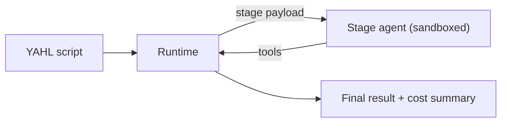

# How it works under the hood

- A YAHL task file is YAML; stage `logic` holds the pseudo-code the agent or VM runs.
- The runtime reads it, slices it into stages, runs VM-evaluable control blocks (`CONTEXT` / `IF` family) inside `isolated-vm`, then hands AI stages to the model in a sandboxed agent container.
- Anything worth keeping goes into a shared context bucket; everything else is forgotten between stages.
- Each stage declares **key allowlists** in YAML so context stays bounded and debuggable:
  - `contextKeys` — which shared context (and loop-local) keys the stage/agent may read
  - `produceContextKeys` — which keys the stage must write via `set_context` before it can finish (runtime retries if any are missing)
  - `updateContextKeys` — which produced keys get merged back into global context after the stage (on loops, after each iteration)
- The AI talks back through structured tools — set a variable, run a shell command, ask user choices, ask for chunked extraction, call Mastermind.

