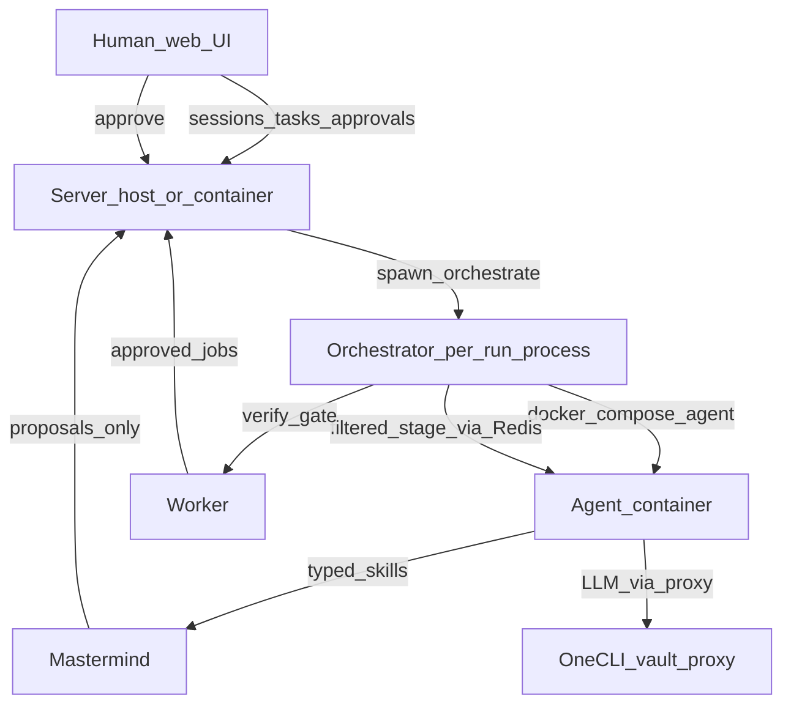

# How to run

**Prerequisites:** Node, pnpm, Docker.

**Monorepo layout** (Omniflex workspace member; install packages from `../`):

| Path | Package / role |
|------|----------------|
| `runtime/` | `@project-yahl/runtime` — YAHL runtime + orchestrator |
| `server/` | `@project-yahl/server` — Express + Mongoose session/tasks API |
| `web/` | Vite + shadcn — Sessions, Tasks, platform approvals, cron jobs |
| `mastermind/` | Personal assistant gateway (HTTP skills) |
| `worker/` | Cron ticks (via server API), platform approvals |

Install and build framework packages from the **Omniflex repo root**:

```bash
cd ..
pnpm install
pnpm -r --filter "./infras/**" run build
```

Copy [`.env.example`](.env.example) to `.env`. Set at minimum:

- `HOST_REPO_ROOT` — absolute path to this repo (required for agent workspace bind mounts)
- `ONECLI_DASHBOARD_URL` and `ONECLI_API_KEY` — OneCLI proxy for LLM keys
- `CURSOR_API_KEY` — required for nixery `media-to-text` (Cursor CLI); not used by mastermind or worker

Copy `server/.env.example` to `server/.env` if you run the server standalone.

### Docker Compose

| File | Purpose |
|------|---------|
| [`docker-compose.yml`](docker-compose.yml) | Infra and optional built server/web |
| [`docker-compose.agent.yml`](docker-compose.agent.yml) | Per-session agent container (orchestrator only) |

**`pnpm run compose:up`** starts local infra: mongo, redis, onecli, onecli_postgres, **mastermind** (4100), **worker**.

**`pnpm run compose:up:all`** builds and starts mongo, redis, onecli, onecli_postgres, **server** (4000), **web** (5173). Does not start mastermind/worker — use `compose:up` for those, or start them manually from the same compose file.

Image build context is the **Omniflex monorepo root** (`..` from project-yahl). App paths use `OMNIFLEX_APP_DIR` (default `project-yahl`). `COMPOSE_PROJECT_NAME` is independent (Docker naming only).

The agent compose file sets `MASTERMIND_API_URL=http://mastermind:4100` for stage agents.

**Local volume data** (gitignored): [`data/`](data/) (mongo, onecli, mastermind, workspace session files, `whatsapp_auth`, `whatsapp_inbox`), [`runtime/.onecli/`](runtime/.onecli/) (OneCLI CA overrides).

**Dockerfiles:** [`server/Dockerfile`](server/Dockerfile), [`web/Dockerfile`](web/Dockerfile), [`runtime/Dockerfile.agent`](runtime/Dockerfile.agent) (built on the host when orchestrator runs).

#### Why it feels safe (roles and boundaries)

This is about **blast-radius design**, not a formal security audit. It assumes you trust the **server control plane** (host in local dev, `server` container in Docker prod) and your OneCLI vault config.

Runs are started by the server via [`spawn-orchestrate.ts`](server/src/modules/sessions/use-cases/spawn-orchestrate.ts) (`POST /api/runs`, fork, ask-user/verify resume). In **local dev** that orchestrator child process runs on your **host** (alongside `pnpm run dev`); you can still run `pnpm run orchestrate` manually for debugging. In **Docker prod** (`compose:up:all`) the same spawn happens **inside the server container** (built orchestrator + `docker.sock` to bring up agents). The orchestrator is not its own long-lived compose service — it is a per-run process the server (or you, in dev) starts.

| Role | Runs as | Can touch | Cannot / should not |
|------|---------|-----------|---------------------|
| **Human (web UI)** | Browser | Sessions, tasks, ask-user answers, platform approvals | Spawn agents, read vault keys, bypass approval queue |
| **Server** | Host (`pnpm run dev:server`) or `server` container (prod) | Mongo, task files (`server/tasks/`), spawn orchestrator per run; `docker.sock` in container for agent containers | Run stage logic; control plane only |
| **Orchestrator** | Child process spawned by server (host in dev, inside `server` container in Docker prod); optional manual `pnpm run orchestrate` on host | Stage pipeline, context filtering, verify gates, agent lifecycle | Expose full repo or whole task YAML to the agent; VM control flow stays on orchestrator via `isolated-vm` |
| **Stage agent** | Ephemeral `agent-{sessionId}` container | Session scratch `~/` → `/workspace/sessions/{sessionId}/`, read-only skills, Redis stage queue, typed HTTP to mastermind / OneCLI proxy | Repo source, Mongo, direct vault — tools API only |
| **Mastermind** | `mastermind` container (4100) | Wiki.js GraphQL + read-only `data/knowledge_export`, workspace `/workspace`, HTTP skills | Side effects without approval — proposals go to server first |
| **Wiki** | `wiki` container (`127.0.0.1:${WIKI_PORT}` on host) | Wiki.js Postgres + Local FS export at `data/knowledge_export` | Agent access — human browse at `WIKI_PUBLIC_URL` only |
| **Worker** | `worker` container | Cron (via server API), platform approvals, optional WhatsApp Web send/receive, SMTP outbound | Does not spawn orchestrator or agent containers; WhatsApp/email I/O is pure runtime (no YAHL) |
| **OneCLI** | `onecli` container | Provider secrets in vault; MITM proxy (10255) | Keys are scoped by dashboard host/path rules you configure |

Concurrent sessions each get their own agent container and scratch dir (agent `~/` = session subdir; see [mastermind/decision-log.md](mastermind/decision-log.md)).

**Local dev:** server on host spawns orchestrator on host; agents still run in Docker via `docker-compose.agent.yml`. Manual `pnpm run orchestrate` bypasses the server spawn path but uses the same agent isolation.

**Docker prod:** server container spawns orchestrator inside the container (`dist/orchestrator` when `NODE_ENV=production`); the server’s `docker.sock` mount starts per-session agent containers on the shared network.

**How the agent container is restricted:**

- **Ephemeral and scoped** — orchestrator brings up one agent per run ([`compose-onecli.ts`](runtime/orchestrator/-docker/compose-onecli.ts), project `agent-{sessionId}`), then tears it down.
- **Minimal mounts** — only [`data/workspace/`](data/workspace/) (writable) and [`runtime/orchestrator/SKILLS`](runtime/orchestrator/SKILLS) (`:ro` at `/opt/skills`). No `data/mastermind/`, server code, tasks tree, or `.env` in the agent image.
- **Session scratch** — `AGENT_SESSION_HOME=/workspace/sessions/{sessionId}`; knowledge reads via `nixeryRun` → `~/nixery/get-knowledge/`; study dialogue under `~/nixery/study/` — never the canonical corpus ([`docker-entrypoint.sh`](runtime/agent/docker-entrypoint.sh); see [security.md](security.md)).
- **Structured tools only** — `run_bash`, `browser`, `set_context`, `ask_user`, `mastermind`; orchestrator applies writes and enforces `produceContextKeys` / `contextKeys` allowlists.
- **One stage at a time** — Redis envelope carries filtered context + a single stage payload; the model does not see full task YAML or future stages.
- **LLM keys sanitized** — with OneCLI, orchestrator injects **proxy env + CA** into the agent override; keep `LLM_API_KEY` as placeholder on the host. Internal services stay on `NO_PROXY` (direct, not through the proxy). See OneCLI setup below for vault rules.
- **Mastermind is HTTP** — agent calls `MASTERMIND_API_URL` with named skills (policies, dispatch, notifications). Outbound notifications/settings are **proposals** until someone approves at `/platform/approvals` with `PLATFORM_APPROVAL_TOKEN`. Cursor credentials are not injected into mastermind.
- **VM control flow off-agent** — `CONTEXT` / `IF` blocks run in `isolated-vm` on the orchestrator process, not inside the agent.

`docker.sock` on **server** only: the server spawns orchestrator/agent containers per run. It is not mounted into agent or worker containers.



### Local development

1. Start infra: `pnpm run compose:up`
2. Run API + runtime: `pnpm run dev` (server + runtime hot reload)
3. Run web (separate terminal): `pnpm run dev:web`
4. Run a session: `pnpm run orchestrate`

Individual commands:

| Command | What it does |
|---------|--------------|
| `pnpm run compose:up` | Infra only (mongo, redis, onecli, mastermind, worker) |
| `pnpm run compose:up:all` | Full Docker stack (infra + built server + web) |
| `pnpm run dev` | Server + runtime on the host |
| `pnpm run dev:server` | API server only |
| `pnpm run dev:web` | Web UI only |
| `pnpm run orchestrate` | Run orchestrator (spawns agent containers) |

The server container bind-mounts `./server/tasks` so Tasks UI edits persist on the host repo.

### Advanced orchestrate flags

| Flag | Purpose |
|------|---------|
| `--session-id <id>` | Session to run (required; server prepares task/fork state before spawn) |
| `--resume-id <questionId>` | Ask-user checkpoint resume |
| `--verify-resume-id <verifyId>` | Verify checkpoint resume |
| `--produce-keys-resume-id <verifyId>` | Produce-keys retry resume |

Create a session via `POST /api/tasks/:taskId/runs` (or fork API), then orchestrate with `--session-id` only. Deprecated: `--task-id`, `--forkrun-id`.

Example: `pnpm run orchestrate -- --session-id my-debug-session`

### OneCLI setup

1. Start infra: `pnpm run compose:up`
2. Open OneCLI dashboard at `http://127.0.0.1:10254`
3. Create an agent identity and copy its token
4. Add provider credentials to OneCLI vault with correct host/path patterns
5. Set `ONECLI_DASHBOARD_URL` and `ONECLI_API_KEY` in `.env`
6. Run one orchestrator session to bootstrap shared override files under `runtime/.onecli/`
7. Keep `LLM_API_KEY` / `DEEPSEEK_API_KEY` as placeholders only. Browser automation uses Stagehand (local Chromium in the agent container; see [`runtime/orchestrator/SKILLS/stagehand/SKILL.md`](runtime/orchestrator/SKILLS/stagehand/SKILL.md)).

### WhatsApp + outbound channels

WhatsApp send/receive and SMTP live on the **worker** only — not in stage agents, not in Mastermind. YAHL tasks (`greets`, `whatsapp_wiki_stack`, `traffic_monitor`, …) propose notifications or tidy wiki; the worker does the actual delivery.

From [`.env.example`](../.env.example):

| Variable | Purpose |
|----------|---------|
| `WHATSAPP_ENABLED` | Set `true` to start `whatsapp-web.js` in the worker |
| `WHATSAPP_WHITELIST` | Comma-separated phones / chat ids; matching propose recipients are pre-approved |
| `WHATSAPP_AUTH_PATH` / `WHATSAPP_INBOX_ROOT` | In-container paths (compose defaults: `/whatsapp/auth`, `/whatsapp/inbox`) |
| `SMTP_HOST`, `SMTP_PORT`, `SMTP_USER`, `SMTP_PASS`, `SMTP_FROM`, `SMTP_SECURE` | Outbound email |
| `SYSTEM_ADMIN_EMAIL` | Alert target when WhatsApp is unavailable mid-send |
| `EMAIL_WHITELIST` | Comma-separated emails; matching propose recipients are pre-approved |
| `PLATFORM_APPROVAL_TOKEN` | Required for human approve at `/platform/approvals` (`X-Approval-Token`); empty disables approve |
| `SANITIZE_CHANNEL_MESSAGE` | Optional host path mounted into worker as `/sanitize/sanitize-channel-message.mjs` |

Compose mounts host `data/whatsapp_auth` and `data/whatsapp_inbox` into the worker (outside the agent workspace). Worker health listens on `127.0.0.1:${WORKER_HEALTH_PORT}` inside the container (default **4091**; compose healthcheck only — not published to the host).

**First login**

1. Set `WHATSAPP_ENABLED=true` (and `PLATFORM_APPROVAL_TOKEN` / whitelists as needed) in `.env`.
2. `pnpm run compose:up` (or restart the `worker` service).
3. Scan the QR printed in the **worker** console once; session persists under `data/whatsapp_auth`.

**Operator flow**

1. Run task `greets` with a phone/group `channelRef` (and optional `register_channel: true` so inbox capture starts).
2. Create a cron for `whatsapp_wiki_stack` (e.g. every 4h) — see API examples below.
3. Optional morning `traffic_monitor` cron with `runInput` (origin, destination, `notify_to`, …).

Inbound text for onboarded chats lands in `data/whatsapp_inbox`; stack clears processed messages after wiki upsert. Media is logged and skipped.

### Smoke tests

```bash
# OneCLI dashboard
curl -sf http://127.0.0.1:10254/

# OneCLI proxy route
curl -x http://127.0.0.1:10255 -H "Authorization: Bearer placeholder" https://api.deepseek.com/models

# Mastermind health
curl -sf http://127.0.0.1:4100/health

# Server aggregated health (mongo + mastermind)
curl -sf http://127.0.0.1:4000/__/health

# Worker health (in-container loopback; compose healthcheck uses this)
docker compose exec worker node -e "fetch('http://127.0.0.1:4091/health').then(r=>process.exit(r.ok?0:1))"

# Full stack doctor (host)
pnpm run doctor

# Runtime
pnpm run orchestrate
```

### Troubleshooting OneCLI

| Symptom | Check |
|---------|-------|
| `gateway unreachable` | Root stack is up; `onecli` container is healthy |
| `sdk config fetch failed` | `ONECLI_DASHBOARD_URL` and `ONECLI_API_KEY` are set and valid |
| `certificate rejected` | `runtime/.onecli/` contains refreshed CA files and compose override |
| `provider key not injected` | Host/path matching and agent permissions in OneCLI dashboard |

### API reference

**Tasks**

| Method | Path | Description |
|--------|------|-------------|
| GET | `/api/tasks` | List discovered YAHL tasks |
| POST | `/api/tasks` | Create a task |
| GET | `/api/tasks/:taskId` | Get task YAML/metadata |
| PUT | `/api/tasks/:taskId` | Update a task |
| POST | `/api/runs` | Start an orchestrator run |

**Sessions**

| Method | Path | Description |
|--------|------|-------------|
| GET | `/api/sessions` | List sessions (add `?includeArchived=true` for archived) |
| GET | `/api/sessions/:sessionId` | Get session |
| PATCH | `/api/sessions/:sessionId` | Patch session |
| DELETE | `/api/sessions/:sessionId` | Soft- or hard-delete |
| GET | `/api/sessions/:sessionId/events/stream` | SSE live events |
| GET | `/api/sessions/:sessionId/stages/replay` | Stage rows for prefix fast-forward |
| POST | `/api/sessions/:sessionId/fork-sessions` | Create fork session and spawn orchestrator |
| POST | `/api/sessions/:sessionId/verify-checkpoints/:verifyId/resume` | Resume from ask-user timeout checkpoint |

**Fork sessions**

| Method | Path | Description |
|--------|------|-------------|
| GET | `/api/fork-sessions/:forkSessionId` | Load fork setup for orchestrator |

**Platform** (Mastermind proposals, cron jobs, worker queue)

| Method | Path | Description |
|--------|------|-------------|
| GET | `/api/platform/proposals/pending` | List pending proposals |
| POST | `/api/platform/proposals/:proposalId/approve` | Approve a proposal (`X-Approval-Token` must match `PLATFORM_APPROVAL_TOKEN`) |
| POST | `/api/platform/proposals/:proposalId/reject` | Reject a proposal |
| POST | `/api/platform/proposals/notifications` | Draft notification proposal |
| POST | `/api/platform/proposals/settings` | Draft settings proposal |
| GET | `/api/platform/work/pending` | List pending worker jobs |
| GET | `/api/platform/cron/jobs` | List cron jobs |
| POST | `/api/platform/cron/jobs` | Create a cron job |
| GET | `/api/platform/cron/jobs/:id` | Get a cron job |
| PATCH | `/api/platform/cron/jobs/:id` | Update a cron job |
| DELETE | `/api/platform/cron/jobs/:id` | Soft-delete a cron job |

#### Example: traffic monitor cron

Create a job at `/platform/cron-jobs` (or `POST /api/platform/cron/jobs`) so the worker starts [`traffic_monitor`](../server/tasks/traffic_monitor/SKILL.yahl) at 08:00 HKT:

```json
{
  "enabled": true,
  "schedule": "0 8 * * *",
  "timezone": "Asia/Hong_Kong",
  "taskPath": "traffic_monitor",
  "runInput": {
    "monitor_minutes": "60",
    "notify_to": "91234567",
    "origin": "Kowloon Tong",
    "destination": "Hong Kong International Airport",
    "city": "Hong_Kong",
    "timezone": "Asia/Hong_Kong",
    "source_instruction": ""
  }
}
```

The task runs adaptive ETA polls for `monitor_minutes` (default 60; agent `run_bash sleep`); WhatsApp proposals go to `notify_to` (default `91234567`). Optional `source_instruction` is a this-run free-text override (leave blank for normal durable ops — see [tricks.md](tricks.md)). Approve outbound drafts at `/platform/approvals` with `PLATFORM_APPROVAL_TOKEN` (or set `WHATSAPP_WHITELIST` so matching recipients are pre-approved).

#### Example: WhatsApp wiki stack cron

With `WHATSAPP_ENABLED=true`, scan the QR printed in the worker console once. Greet a phone/group via task `greets` (optionally `register_channel: true` to enable inbox capture), then create:

```json
{
  "enabled": true,
  "schedule": "0 */4 * * *",
  "timezone": "Asia/Hong_Kong",
  "taskPath": "whatsapp_wiki_stack"
}
```

Pending inbox text (onboarded chats only) is stacked into wiki under `whatsapp/{folder}/` and then cleared. Media is logged and skipped.

Long poll stages (e.g. `traffic_monitor` monitor) set stage `agentOverrides.bashTimeoutMs` (e.g. `360000`) so a single `sleep 300` can finish. Shared agent default remains **60000** when unset — do not pin timeout in compose.

SSE streams expose live run logs (`meta` / `log` / `status`) and session events for the web UI.

Session persistence uses normalized Mongo collections (`Sessions`, `Stages`, `SessionToolCalls`, `SessionModelResponses`, `SessionAskUserQuestions`, `SessionVerifyCheckpoints`, `ForkSessions`, and related rows). After upgrading schema, wipe the database or drop those collections so old single-document `sessions` rows do not conflict with the new layout.

### Ask-user timeout and recovery

Orchestrator waits at most `YAHL_ASK_USER_MAX_WAIT_MS` (default `600000`) and polls every `YAHL_ASK_USER_POLL_MS` (default `250`). After a timeout it stores a verify checkpoint on the session; the web UI **Resume from checkpoint** POSTs `/api/sessions/:sessionId/verify-checkpoints/:verifyId/resume`.

With `REDIS_URL` set consistently on **server** and **orchestrator/agent**, answering an ask-user question publishes to `yahl:ask-user-answered:<sessionId>` so an in-flight wait can wake before the next poll interval.
