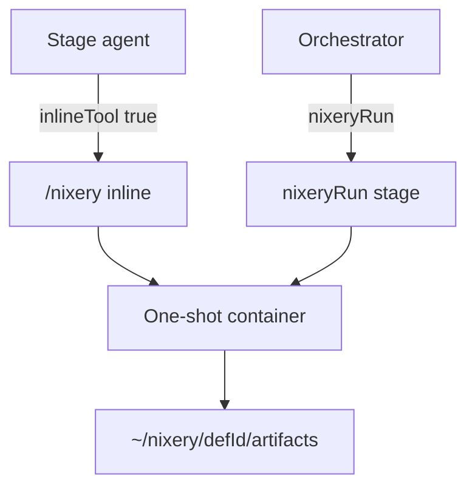

# Nixery — concepts & layout

Nixery is the **installable ability runtime** for YAHL: typed one-shot containers invoked via `/nixery(defId, …)`. The SaaS / platform baseline ships this runtime with an **empty catalog** — no pre-installed defs. Plugins under [`server/nixery/`](../server/nixery/) are optional add-ons; install them to grow the `/nixery` surface, uninstall them to shrink it. Zero plugins is a valid deployment.

It is not a chat black box. Each ability (when installed) is a human-authored contract (`index.yml` + `run.mjs` + `validation.mjs`) around fuzzy LLM or Node work. Stage pipeline: [how-it-works.md](how-it-works.md); call syntax: [yahl-syntax.md](yahl-syntax.md).

## Philosophy

| Principle | Meaning |
|-----------|---------|
| **Plugins are the unit** | Capability ships as an installable folder; add or remove it and the runtime’s `/nixery` surface changes — no core builtin list. |
| **Typed shell, fuzzy core** | Each ability is a human contract (`index.yml` / `run` / `validation`); the model only fills fuzzy work inside that shell. |
| **One-shot isolation** | Each call is a disposable container with declared mounts — blast radius is per ability, not the whole host. Details: [security.md](security.md). |
| **Discover, don’t hardcode** | Orchestrator and agents resolve against whatever is installed; catalogs/skills are live install snapshots. |
| **Compose with stages** | Abilities plug in mid-stage (inline) or as orchestrator stages (`nixeryRun`); exhausted inline soft-fails so the stage can continue; exhausted `nixeryRun` hard-fails. |
| **Artifacts travel with the plugin** | Optional skills / prompts / task-skills publish via link when installed and leave when uninstalled. |

Root product framing: [README.md](../README.md).

## Install layout

The install unit is a folder under [`server/nixery/<pluginId>/`](../server/nixery/) with `plugin.yml`. There is no flat top-level tool list and no shared `_lib` at the nixery root — each plugin owns its helpers. The orchestrator only discovers whatever plugins are present.

```text
server/nixery/
  <pluginId>/
    plugin.yml                 # required — install unit + skills/prompts/task_skills to link
    lib/                       # plugin-local helpers (optional compiled dist, etc.)
    <abilityId>/
      index.yml                # def contract; id must match folder name
      run.mjs                  # typical entry
      validation.mjs           # output gate
      …                        # optional prompts, tests
    SKILLS/ | prompts/ | task-skills/   # optional; published by pnpm nixery:link
```

### Install / uninstall

| Action | Effect |
|--------|--------|
| **Install** | Add the plugin dir + `plugin.yml` (+ ability folders). Discovery picks it up ([`shared/nixery/list-defs.ts`](../shared/nixery/list-defs.ts)). Run `pnpm nixery:link` ([`shared/nixery/nixery-link.mjs`](../shared/nixery/nixery-link.mjs)) to publish skills / prompts / task-skills symlinks. |
| **Uninstall** | Remove that plugin dir. Its ability ids vanish from `/nixery(…)`. Re-link remaining plugins; drop leftover symlinks that pointed only at the removed plugin. |

### Empty catalog / live catalog

- With **no plugins**, `/nixery(…)` has nothing to resolve — that is the platform default.
- With plugins installed, agents use whatever skill or catalog those plugins publish (paths and basenames come from each plugin’s `plugin.yml`, not from a fixed platform skill).
- **Ability ids are global** — call `/nixery(defId)` with no plugin prefix. Collisions across installed plugins fail discovery.
- Reserved child names (not abilities): `lib`, `SKILLS`, `prompts`, `task-skills`, plus `_…` / `.…`.
- Discovery and contracts: [`shared/nixery/`](../shared/nixery/). Runtime load / mount / run / validate: [`runtime/orchestrator/-nixery/`](../runtime/orchestrator/-nixery/).

### Optional plugins

A plugin may ship abilities plus optional skills / prompts / task-skills linked on install. Domain behavior — curated stores, channel helpers, verify gates, research helpers, and so on — lives entirely in plugins the operator chooses to install, not in the empty platform. Example: research plugin ability `consult-script-candidate` advises the next knowledge-to-script op (prefer `js` + `yahl-browser`). Mount and write-boundary detail: [security.md](security.md).

## Invocation model



| Mode | Who | When |
|------|-----|------|
| **Inline** (`nixery` tool) | Stage agent mid-logic | Def has `output.inlineTool: true` |
| **`nixeryRun` stage** | Orchestrator | Non-inline defs; following stages read session artifacts under `~/nixery/{defId}/` |

Calls resolve only if the owning plugin is still installed. Otherwise fix args, pick another path from the current install’s skill/catalog, or skip.

Each `runNixeryDef` retries up to `output.retry` attempts (default **10**). On validation or gate failure, the orchestrator rewrites `input.json` with `nixeryRetry.feedback` for in-container LLM agents. Pure Node defs ignore feedback safely.

Mount tokens in `index.yml` (`session`, `def`, `plugin`, `data/…`, …) resolve in the orchestrator. Containers always see `/opt/nixery/def` (ability) and `/opt/nixery/plugin` (owning plugin, read-only).

## Where next

| Doc | Use when |
|-----|----------|
| [security.md](security.md) | Mounts, write gates, trust boundaries |
| [yahl-syntax.md](yahl-syntax.md) | `/nixery(...)`, `nixeryRun`, stage fields |
| [how-it-works.md](how-it-works.md) | Runtime / stage pipeline |
| [how-to-run.md](how-to-run.md) | Compose, env, and operator setup (including optional stacks in this repo) |
| [status-and-roadmap.md](status-and-roadmap.md) | Feature matrix for this repo’s current optional stack |
| [tricks.md](tricks.md) | Operator tips for optional plugins used in this repo |
| [README.md](../README.md) | Product philosophy and quick start |
