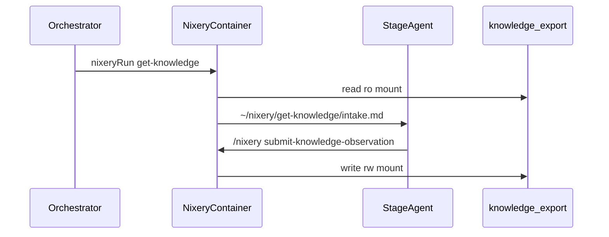

# Protecting the knowledge store

Curated knowledge lives in the filesystem corpus at `data/knowledge_export/` (`en/topics/`, `whatsapp/`, `greets/`). Stage agents do **not** get the export tree or legacy flat keys mounted — they only see nixery session artifacts and task skills.



- **Container mounts** — agent: [`data/workspace/`](data/workspace/) + read-only [`runtime/orchestrator/SKILLS`](runtime/orchestrator/SKILLS) only; **no** export/knowledges ([`docker-compose.agent.yml`](docker-compose.agent.yml)). Nixery **read** defs mount `data/knowledge_export` **ro**; nixery **write** defs mount it **rw**.
- **No direct corpus access** — agents must not read the export mirror or legacy `~/knowledges/`; canonical store is server/nixery-private only.
- **Session-scoped reads** — `nixeryRun: get-knowledge` explores export mirror in-container, writes markdown to `~/nixery/get-knowledge/{output}`; agent reads full file content in following stages.
- **Path injection blocked** — upsert rejects caller `source` / `file` / `path` args.
- **Controlled writes** — `upsert-knowledge-page` accepts `key`+`value` or `page`+`content` with `topic` only; known keys are suggestions (unknown keys soft-default to a slug page).
- **Human browse/edit** — code-server at `/code/` (dev: `127.0.0.1:${CODE_SERVER_PORT:-8080}`); web sidebar **Knowledge** opens `data/knowledge_export` in the IDE; agents never use this route.
- **Untrusted task hints** — task SKILL files loaded via `guidelinePath` on nixery `research` get an explicit untrusted-content banner in the prompt.
- **Workspace vs knowledge** — `extract-info` = RAG over session workspace files; `get-knowledge` = curated corpus via export mirror. Different defs, different trust boundary.

### Outbound channels

- **Worker-only volumes** — WhatsApp auth (`data/whatsapp_auth`) and inbox (`data/whatsapp_inbox`) mount into the worker container only. Stage agents never see them.
- **Proposals stay on the server** — Agents never send WhatsApp or email. Outbound goes through platform proposals; humans approve at `/platform/approvals` with `PLATFORM_APPROVAL_TOKEN` (`X-Approval-Token`).
- **Whitelist pre-approve** — `WHATSAPP_WHITELIST` / `EMAIL_WHITELIST` matching recipients skip the approval queue for that channel.
- **SMTP admin alert** — when WhatsApp is unavailable mid-send and SMTP is configured, the worker may email `SYSTEM_ADMIN_EMAIL`; it does not open a side channel for agents.

Read pattern in stage logic:

```text
Read ~/nixery/get-knowledge/identity.md from the session workspace.
If missing or empty after trim, set extracted to '<none>'; otherwise set extracted to the file's full markdown content.
```