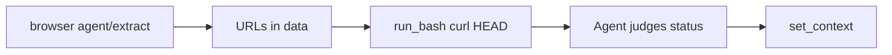

# stagehand — Browser automation (Stagehand)

**Use the `browser` API tool for all web search and browse tasks.** Do not use Brave Search for `/stagehand(...)`.

- **Browse/search:** use `browser` only — no curl for page fetch, search, or scraping.
- **Post-extraction validation:** after `browser` returns URLs, use `run_bash` with the curl HEAD pattern below to sanity-check reachability before `set_context`.

## Tool: `browser`

```json
{
  "mode": "goto | act | extract | observe | agent",
  "instruction": "<natural language>",
  "url": "<optional URL>",
  "schema": { "<JSON Schema for extract>" },
  "maxSteps": 15
}
```

Returns `{ "ok": true, "data": ... }` or `{ "ok": false, "error": "..." }`.

After a successful call, persist results with `set_context`.

## Modes

| Mode | Use when |
|------|----------|
| `goto` | Navigate to a URL (`url` required) |
| `act` | Single natural-language action (click, type, scroll) |
| `extract` | Pull structured or free-text data from the current page |
| `observe` | List interactive elements / available actions |
| `agent` | Multi-step research (search, navigate, collect results) |

## YAHL mapping

| YAHL | `browser` call |
|------|----------------|
| `/stagehand(search, topic, ...)` | `mode: "agent"`, instruction describes search + required fields |
| `/stagehand(goto, url)` | `mode: "goto"`, `url` |
| `/stagehand(extract, url, instruction)` | `mode: "goto"` then `mode: "extract"`, or goto URL first in prior call |
| `*browse(url)` | `goto` + `extract` for page text |

## Search example

```json
{
  "mode": "agent",
  "instruction": "Search the web for '<topic>'. Return top 10 results with title, url, snippet, and publishedAt when available.",
  "maxSteps": 15
}
```

Prefer a follow-up `extract` with schema when you need typed JSON:

```json
{
  "mode": "extract",
  "instruction": "Extract search results",
  "schema": {
    "type": "object",
    "properties": {
      "results": {
        "type": "array",
        "items": {
          "type": "object",
          "properties": {
            "title": { "type": "string" },
            "url": { "type": "string" },
            "snippet": { "type": "string" },
            "publishedAt": { "type": "string" }
          },
          "required": ["title", "url", "snippet"]
        }
      }
    },
    "required": ["results"]
  }
}
```

Then validate URLs before persisting:

1. Validate each `results[].url` with curl HEAD (see below).
2. Apply agent judgment on status codes.
3. Call `set_context` with filtered or adjusted results.

## Validate extracted URLs

After `agent` or `extract` returns one or more `url` / `source_url` fields, sanity-check reachability with `run_bash` — not `browser`.

```bash
curl -s -o /dev/null -I -w "%{http_code}\n" \
  -H 'accept: text/html,application/xhtml+xml,application/xml;q=0.9,image/avif,image/webp,image/apng,*/*;q=0.8,application/signed-exchange;v=b3;q=0.7' \
  -H 'accept-language: zh-TW,zh;q=0.9' \
  -H 'upgrade-insecure-requests: 1' \
  -H 'user-agent: Mozilla/5.0 (Macintosh; Intel Mac OS X 10_15_7) AppleWebKit/537.36 (KHTML, like Gecko) Chrome/148.0.0.0 Safari/537.36' \
  "<URL>"
```

- `-I` issues HEAD; output is only the status code via `-w "%{http_code}\n"`.
- Quote URLs in the shell command; escape shell metacharacters when needed.
- For multiple URLs, loop in one `run_bash` call (e.g. `while read url; do ...; done`) rather than one curl per tool round-trip when practical.
- Interpret the code in context — e.g. `200` vs redirect codes vs `403`/`404`/`000` — and decide whether to keep, downgrade, retry with `browser` `goto`, or drop the URL.
- Only persist validated (or explicitly kept) URLs via `set_context`.



## Structured scrape example

```json
{
  "mode": "goto",
  "url": "https://example.com/news",
  "instruction": "navigate"
}
```

Then:

```json
{
  "mode": "extract",
  "instruction": "Extract news articles with title, url, date, and summary"
}
```

## Persistence pattern

1. Call `browser` with the appropriate mode.
2. When results include URLs, validate with curl via `run_bash`.
3. Call `set_context` with `scope: "global"` or `"stage"`, the target key, and cleaned `value` data.

## Timeouts

- `goto`, `act`, `extract`, `observe`: ~120s
- `agent`: up to ~300s; keep `maxSteps` ≤ 15 unless the stage requires more

## Notes

- Chromium runs locally in the agent container (headless).
- Reuse the same browser session within a stage; multiple `browser` calls share one Chromium instance.
- For large page text saved to `~/tmp/`, follow up with `/nixery(extract-info, source: ~/tmp/…, need: …)` per `/opt/skills/nixery/SKILL.md`.
- HEAD may differ from full page load (paywalls, bot blocks, redirect chains without `-L`); use judgment — invalid HEAD does not always mean the URL is useless for a later `goto`.
